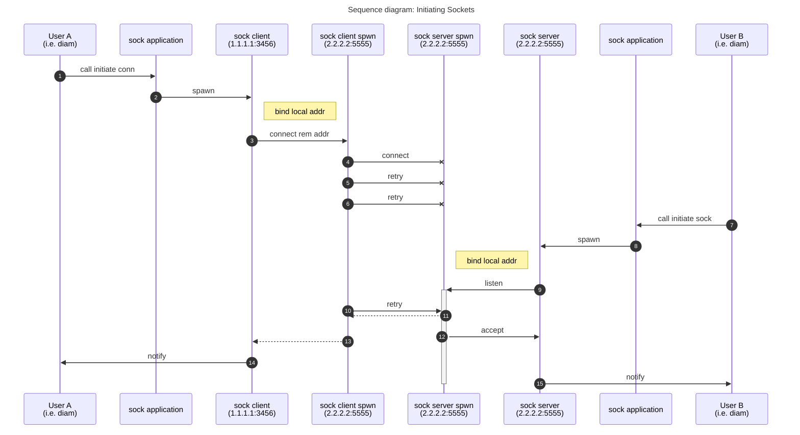

Socket management application
---

If called it will open a socket, optionally bind the socket, and
either try to connect to a remote address, or listen and accept
incoming connections.

It will monitor the sockets and recreate it if possible.

After a link is established it will notify a higher layer (the initial
calling user).

Will reuse the socket if the local address has already been bound or
if a link has already been established.





SCTP
---

This library is made mainly for the SCTP user application in mind.

From IETF RFC2960:

* SCTP user application (SCTP user): The logical higher-layer
application entity which uses the services of SCTP, also called
the Upper-layer Protocol (ULP).

* SCTP association: A protocol relationship between SCTP endpoints,
composed of the two SCTP endpoints and protocol state information
including Verification Tags and the currently active set of
Transmission Sequence Numbers (TSNs), etc. An association can be
uniquely identified by the transport addresses used by the
endpoints in the association. Two SCTP endpoints MUST NOT have
more than one SCTP association between them at any given time.

* SCTP endpoint: The logical sender/receiver of SCTP packets. On a
multi-homed host, an SCTP endpoint is represented to its peers as
a combination of a set of eligible destination transport addresses
to which SCTP packets can be sent and a set of eligible source
transport addresses from which SCTP packets can be received. All
transport addresses used by an SCTP endpoint must use the same
port number, but can use multiple IP addresses. A transport
address used by an SCTP endpoint must not be used by another SCTP
endpoint. In other words, a transport address is unique to an
SCTP endpoint.

Options
---

```erlang
local_addresses: list()
local_port: non_neg_integer()
remote_addresses: list()
remote_port: non_neg_integer()
```

Examples
---

```erlang
1> application:ensure_all_started(sock).
{ok, [sock]}.
2> sock:start_client(#{remote_addr => #{port => 3565, addr => {127,0,0,1}, family => inet}}).
{ok, _}
3> sock:start_server(#{local_addr => #{port => 3565}}).
{ok, _}
4> sock:connect(#{port => 3565, addr => {127,0,0,1}, family => inet}).

```
