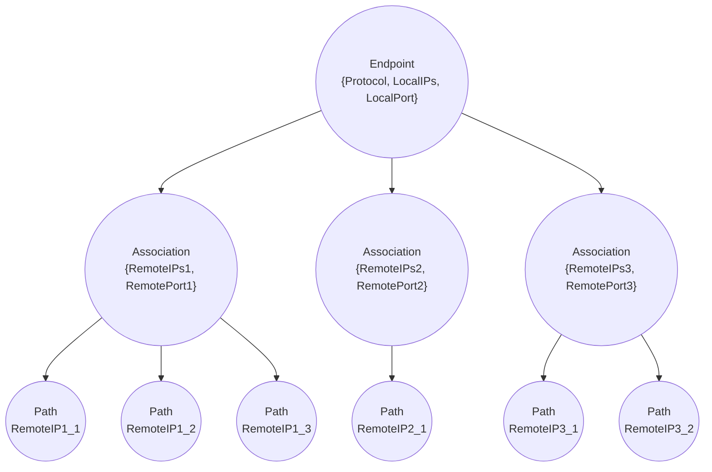

# Overview

Setting up and managing connections via sockets.


# API

```erlang
-type port_no() :: inet:port_number().
-type address() :: inet:ip_address().

-opaque assoc() :: pid().
-opaque path() :: {assoc(), address()}.
-opaque ep() :: pid().

-type received_msg() :: {data, assoc(), Payload :: binary(), MetaData :: map()}.

-type anc_data() :: socket:cmsg_recv() | #{level := level() | integer(), type := integer(), data := binary()}.

-type accept_callback() :: fun((address(), port_no(), [anc_data()], CurrentAssocs) -> boolean()) |
                           fun((address(), port_no(), [anc_data()]) -> boolean()).

-type local_opt() :: {accept, non_neg_integer() | accept_callback()} |
                     sctp_opts().

-spec create_ep(LocalAddrs :: [address()], LocalPort :: port_no(), [local_opt()])
    -> {ok, ep()} | {error, inet:posix()}.

-spec create_assoc(ep(), RemoteAddrs :: [address()], RemotePort :: port_no(), [assoc_opt()])
    -> {ok, assoc()} | {error, inet:posix() | not_found}.

-spec send_msg(assoc(), Payload :: binary(), MetaData :: map(), [send_opt()])
    -> ok.

-spec get_eps()
    -> [ep()].

-spec get_ep(LocalAddr :: address(), LocalPort :: port_no())
    -> {ok, ep()} | {error, not_found}.

-spec get_assocs(ep())
    -> {ok, [assoc()]} | {error, not_found}.

-spec get_paths(assoc())
    -> {ok, [path()]} | {error, not_found}.

-spec find_assoc(LocalAddr :: address(), LocalPort :: port_no(), RemoteAddr :: address(), RemotePort :: port_no())
    -> {ok, assoc()} | {error, not_found}.
```




# Example

```erlang
%% start application supervisor
application:ensure_all_started(sock).

%% create a sctp ep on loopback interface with a free port
{ok, EP} = sock:create_ep().

%% connect sctp ep to remote address 127.0.0.1:30400
sock:create_assoc(EP, [{127,0,0,1}], 30400, #{}).

%% create another sctp ep which listen and accept for up to 4 clients
{ok, EP2} = sock:create_ep(30400, #{accept => {accept, 4}}).
```

# Receive

Each read payload from the socket will be message passed to the
process that called create_ep, see type `received_msg()`.

# SCTP

This library is made mainly for the SCTP user application in mind.

From IETF RFC2960:

* SCTP user application (SCTP user): The logical higher-layer
application entity which uses the services of SCTP, also called
the Upper-layer Protocol (ULP).

* SCTP association: A protocol relationship between SCTP endpoints,
composed of the two SCTP endpoints and protocol state information
including Verification Tags and the currently active set of
Transmission Sequence Numbers (TSNs), etc. An association can be
uniquely identified by the transport addresses used by the
endpoints in the association. Two SCTP endpoints MUST NOT have
more than one SCTP association between them at any given time.

* SCTP endpoint: The logical sender/receiver of SCTP packets. On a
multi-homed host, an SCTP endpoint is represented to its peers as
a combination of a set of eligible destination transport addresses
to which SCTP packets can be sent and a set of eligible source
transport addresses from which SCTP packets can be received. All
transport addresses used by an SCTP endpoint must use the same
port number, but can use multiple IP addresses. A transport
address used by an SCTP endpoint must not be used by another SCTP
endpoint. In other words, a transport address is unique to an
SCTP endpoint.

